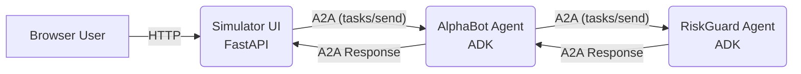

# Agentic Trading Simulator

[](https://www.python.org/)
[![Framework](https://img.shields.io/badge/Framework-ADK-4285F4.svg?logo=data:image/png;base64,iVBORw0KGgoAAAANSUhEUgAAAEAAAABACAYAAACqaXHeAAAABGdBTUEAALGPC/xhBQAAACBjSFJNAAB6JgAAgIQAAPoAAACA6AAAdTAAAOpgAAA6mAAAF3CculE8AAAAhGVYSWZNTQAqAAAACAAFARIAAwAAAAEAAQAAARoABQAAAAEAAABKARsABQAAAAEAAABSASgAAwAAAAEAAgAAh2kABAAAAAEAAABaAAAAAAAAAEgAAAABAAAASAAAAAEAA6ABAAMAAAABAAEAAKACAAQAAAABAAAAQKADAAQAAAABAAAAQAAAAAC1ay+zAAAACXBIWXMAAAsTAAALEwEAmpwYAAABWWlUWHRYTUw6Y29tLmFkb2JlLnhtcAAAAAAAPHg6eG1wbWV0YSB4bWxuczp4PSJhZG9iZTpuczptZXRhLyIgeDp4bXB0az0iWE1QIENvcmUgNi4wLjAiPgogICA8cmRmOlJERiB4bWxuczpyZGY9Imh0dHA6Ly93d3cudzMub3JnLzE5OTkvMDIvMjItcmRmLXN5bnRheC1ucyMiPgogICAgICA8cmRmOkRlc2NyaXB0aW9uIHJkZjphYm91dD0iIgogICAgICAgICAgICB4bWxuczp0aWZmPSJodHRwOi8vbnMuYWRvYmUuY29tL3RpZmYvMS4wLyI+CiAgICAgICAgIDx0aWZmOk9yaWVudGF0aW9uPjE8L3RpZmY6T3JpZW50YXRpb24+CiAgICAgIDwvcmRmOkRlc2NyaXB0aW9uPgogICA8L3JkZjpSREY+CjwveDp4bXBtZXRhPgoZXuEHAAAQ5klEQVR4Ae1ae3Bc1Xk/5z52V7uSbGzL5lUYqBuKNTEPCxt3UryWDISkZAaS9dC0Q6APTBiYhoSZxIQ26xnAeDpp0ibTYKdtoCkZRotLprQhpra0ZtzgICk1pjKhoTRxCGCEbcnSStq9597T3+/sXmkl70q7G/FXdXbu69zvcb7H+b7vnLtCLLZFDSxqYFEDixr4/6sBuZCip9PaygphkWb2K8IXUuoFoa+FTO5I2mIT6B5MBiKdDhaE7kIRSXVrO5XS9kLRm49Oqjtl85gPrpb3Ti1AVWG0hmWydmarVITZsmv0cl/Jj1pSbNBaXCKEbhGBawWxd0XuvK8J7fwcUBEcdRkwEFqPwgl+LqV8KRD+vszWzGsgIpLppJP9ShaeJhr2tIanAK0OwX0OZPOjE5uk9r8shLzebYpjvBAdMmqNsQW2yP3GHuEl/kFIfzVAPKLU16QU0sGBqxorEHe/tKyH+7ZmDvKB3gClmLHwuZ7WkAKSae1k01Kt263d1qHct51o4jMYm1CFnBZa5iE6x0AXtaW2xOjFO4UfeQHKuKR+BZCURDzRjCkkK6J2kyt1AFZ59UQwsvyugW17vGQvvGFz1niigarxVLcCkuleCL9ZJdNj51qu6HHjicu98RwDnoLJXTuasCyEQV/5IlAT8PaIVs2vy4mVfym0lcOwGCNr9Fi6NnzfitiCh/YxAcZVABIe+h2nJWqr0fxr8IZOeMO7Zkqk61NCXQpglE+nZQAPWGq5uVecWOIiNZmjT1q2G3c0/F77k9kg0M/awvmJ0OokTBdE8y1i9PxekV/xOYCuxQEnqbEFgbKEtldAF1fBy26BIpL0hCDv09qBHXcj/rh3XEX9K47c8v1hZAirnixRlwJgOcBL3fnI6EGnqfk6NUHhpeXE4o7K514NguCe7EOth2qUrSGwdd2pj8gg+FsI/mF/woPXQQkJKCHnvdh/295N9Bj8anQxzq4aWzjvux4e+7zTnPiqlytaHl7geBNje3sfavkUSTE4Dh0Tsm2N0O3HygeyQ6Rr5DUbLLVmUA61Dcm2oTYdBruOpz/5DJTwSVjfeILTGo14Z/JfGLht71/VEw9qUwDSHYuaG9MjyzzX/h/YfKkOlIfg5yLwvdDzYPONHPS6u/rdgT0dDYT52SJXf163+y6XQY8QUMI+BMQboAQPWcLVvh6O+dFLD/3B907X6gmmaqvOrvgmucNEdKEi9h0IehS+ACW4Kj82IkXwaUIxOH7QwpOPifjI/7y3IsGn/UlvuCR8wWmOLJ2w83fyXTKLyrGGVpMCsqXKBfl9a1BMNNqJRqnkXQcebD3ZntYRZoYZ/BAwOR3YR+UU48cMiDkfirjwPNKZVWVmEenbu1ORl2999iSK7V3wAtLSgRdwTm/lQ/ZgtqZqa34FYACCkX/X+IWYBmt9bxzkZdRDALRt+ykyG0QJwOtU45QBTlgoFZXDdQGDaA0N+EVc4JBORvrMQOWYg8faDc/Asr6H4oiZKBoUTNfaDf9064UIOFwzzMApxw/vjSuFD5WuqTVCZvDCCeRq6USbfG/CsyMJNyiMH93/pabjyP2MD9Pa5kDxnEyfWWG59reAejUEz/R8uflLzCB4phKqRmkKmgb+5kfGbgcgcYalJf4svV320ROoDOALk+rgggMycxyx4KgVdTqCSeVZKJN8HawGxFsMnhz7XG1eDTGikwAqr3OlTXDpY0CQQL/Jfq4FeA0bFcZ727Ufjy2Jf0pK69LYksQXOx8evZf9yCYz4NkXtlSq22ad0flI7monknjScpsudxPxjeD9LPBiReGnvcisEIGMqfkmS2Vw9qXDwenzSJOZI6Rd7TqvAkJELVSspIqiDYXgXEBLmnN4Ct0e6fmq/JlJKE6dUZNUmLw2hKl2HWpPFZUtxJUW1BR4E6NebnwSAfcCaY9eTLx0ujgKQ2NTiZIU40z+bCzJgcsVV02tZgVI6YyVHLdUZsil5MB8X86pGPDQI2V3tDUmnFhzKz3GsuTTleDLcbOlYCu13IfaYgwZpyXaGo+JwD/U++etr0ONkh4S4rAu4D1kPkdzBYZbXlCJsuYW4qA5z3maVwGhgH7gvRUoE2TswOc01JeRcmjxkEs2nTRzFLXB9snRifu8ydxT/sT47x14MPGvAvN7NnyIZ64QjjGg56H4ryDlRm9i/Nv5kdxjvle4ufi+zProCIsimOAyjSUCmq09rEGkeIsPbWuKCuJ9tVb0m2pv2T+zCHpDWvY5OvADuKUVeOrK3r9ofmVGcDK0OE9NwJumzOBYZr3pF2ffUQnlli6SNMF2ytvCJfD6p2+5Qlv2EcQJjAm+FujTjmWtfmlr5hTnHX5TOGdzgmdW6pzRhwqQOXlfeskpCHXYdmN8XbBRB0hb3m1g24uF0jReMdojcDk8TE6vUXjSoPBUQogfGmGavhDHistt5Dr7s6U6oIBMQGkPU3izYzSP8KQ3bxokUJgJMJDvQmU3ocvGQgjLIPvuzTtzf5fZLgdSKIYyacl8HDadxZ5B+FDvteQBxfmenonNImhwa6ZwdXdqHWTcpsyyBEagOQPxXULXkgEIN/8UIFRpFci7zkfGfor0dJn2JguoCyKBmjwexBNXZO+Xwzfd97Po83+zuoAAOKfbkU5DDS7dnkm5FP7DT338nKgdO4Ja46LA8wtYJkeCgv86VoSXgzb5U7Z5x1GTB3A+0x1pUWxLPWDZ1nPK05ZWkwpF0UVifKw/uXPyo89vj70hvoHECNiGBKyEtGkHerPmTVZm1aAwll9tBf4PrZhzEYofepnF/B8Uggdwj7EmMdbaNkZq9ADD3whGJXQ+mvtGJB6/t1BaEsMjHHoEdL7DKajHi/GiiLOQ543dqWVK+9sQ7nag4kM1WtwUcYtL4W/C+vfVIzzHVpcCZk2Ff4kkEjdDCWZpiorPdWJNAmuEYcD1wFv7MSFPIDD72Cmqkw9G5rsiaP6VHrvgHluK2CqtIx1wxE4nEVmqyFJrw9ddEnW9kfxzEP4TRtk1RH4DVzrVP7CydIZ48B0UK3eoyTwrPjP3oYioHUHRiIBUrE3K2dV3z0iSX/4TMdGGJYG/SgSTqCy1BjNEGVtGsCEi/NHCE3237b3TUK5zO4w49SsASOmyPA0l3IEBfdVNJJb5BW6ETrIQonXCQITbRhrQGUqQSEYv+YLW1juocmOudLEiidlCjRZOIck/0HfbM98x1BsQnngNKcAwRIGUyghT2SXTp5dakci9cIPbLTv6W3bErM/nD8GGUPUTi16v9bjIXXCfkEGL8PPIsir4WSDlP2J3+JtH7vz+sCmIUhluBFDhdbfGFVBiFWYH8wildD023gHX78B4ViN7LsWqcf5iq+KwsdfkDuOL0l9jW7nvtBWc94YQk/19P107YJbCwKln768ii0Y6IZyte4Uz4+jf7XZ3dzc1Qq8RHAoOe//axiPvuvK1TiPf8ivNWW0be0xUTmP7Ky2S+M3dfv/tAfmhwqj9asuE/uflN1WgWcLflMXNDvNwz8E269K339Tr8AUI0jfk8iWqU5e6tah67E+g3MTqzHJYp1oSqxBtuXD5N524ekz+jpiAl/AzXtUB6hQ+mWWmFQlAfE8F1TmaUX56GkanUqDR2PfAOdhUfqW7i4sdb7/zmO7HB6DDpePHuPL4EY5XXa32u0+SQghfiZpet664g3nzuviJLetvP9G1fqPBmSMgQ0HGUCe3bLiWOO/esDZhcEq0KvGptW/eAAVrWnKr8HWPe4UTFV9Up5HpxoSHo6BGxaQ5xkVOvI89IMG/MGC0gK80AAovBwa8oc0dlw2NW0eXO/aTrY71o/e7rvlDSKhp1dl4xtJ4dwIwcVu+RBzLj75CGqQVKnQ2Xq3P8yoAZbiB8YPgSkHbITjj7DiuiDgtIuY040iIhGjhK72bjGd7AC3Ym0w6HPB7nR03BZY8Gret3zzlqRw+8nIDo7isJnKVhil1N2GJQ1zSIC3SJG3yqII6Z/f8CphCnwL1HRR6yhOHCiN6q5+Tf+Tl5J+oEdHlblE7CV7uAd2cq9DJ5mxWDXV2fK7JsX/gSBkZxxYTQCNxh5t/opd42aGzNzGn+gBjYIFDXNIgLdIkbfIgL9Kpp82rNaY7uVkozO/P2C36Cbq80ypi3ojeE7neN+E/ZDg7+GlaHYPje7jw7mWuc9dpT3G7SMFizjmuI08p7/FV+/s/SxhakYLwPmzlfSe2dHxrmePefRYNT+1ZdaDPjKWcZ0hjruuUWecC4rvAfHQpQZl4bZmtISgoZmoCBMryyG/mLoRnwHqv65re5UXhaSkFQLfJtuRwwbt/LuHJjQqhEnhPWOIQF/kYmUcoKEORNnmQFxVeKZYQv1KrWQEzkMEZeStMW4oecpbbI0UNda3/kPRjg62OncTcpctLDN71tC5MKP9jbT39Xw/nLwWdwaPsge+oBMISh7gKNEiLNEmbPMjL8ATvWqdDXYVQ2Ziq3hqXxQBGbty4DP9hONRi222jvs+tMtdFdZDzg/+1pf3xFQcOv2ayQjZrCqiqBEsvjIJoXWaSnv7n399y7ZU53/+3iJSXQKEWeYDXxWO+/x9nutb/dmsmc9KMZQ7FknRjHjDHaLPJpAlEnvKvW+o4bWPKZ2EUgcdIDBT79dbGFfsPv/Y26gBG8DlIVXxFHOKSBmmRJmmTB4SfWOo6Kya0uI7I4VgqEip1LrgCktmsmRrS1gMjShWilsU1gsf/NCFyJ5Aqn3nnd69qO/+5gfFGcjhxiEsapEWapE0e5IWYUMB3zD7KF46F99XagisArhowCC1/oe+X+MvQ9fkgYN7mXMXmnQ6WONZHnKjzyqmuDWtpzXqUYNwfOMS1I85R0iJN0iYP8vK1uH559sdvlQqoME5Vk//XmgKQFW2lsOB+PIrP6GKNzoC1sqfvRaVVO/L265gOLuzkjyjfi0rrPCWCIye2XHOrUUINU1GnEXchPHGIG7Osc0mLNEmbPMjrfPAk71rXCQ17QICKmPLLdlFA+sMeBSJ1ac3AfhYnxl17/vMXQ8vG1w4r9TzqAHqCBUt5SGOyxbL3In1tN14DUsSr1EwwS4uAsAh0e4lLGkCQpEnaQ++Orz0fvMiTvCvRqdRXuwKs0kwjFTgW4s4y5P9z8/sja3iM/FAsM2uGck+AxWiN9sxgYeWBvo+dLvhfg7VsCORib89D0PLbIu6jrOYgjCbs7EEaa+IdYQiLoIpNVu2RRqvjOKcK6uuk3T44WDCw4DmbxlzPNSsApUcI66jit9dblO+8g934/8IxGHecX6oD9s0VPQHuSyu29bz8+RFfbWNKcCxJb5hEKsPGkUxxkMm2sz9mhn2EMbDAIS5pDIMWptn9pM0pUo/lQ6WEQoXPZ1+HigUKAu0vindmpce/ruJfkeYAf+E5cREPArnLEEjRR6abhPvyScPCbfv79ng62Iy0cAbum0jYNnOY+SPHVN0/jVq+PugmLKq+BHFJYxVokSbBQx5lqDXdVp135dgMcLSs9+/OPqdN3CBGyLEMgotf/FtAnRQvYkG0iUGRcaEMYuo2jOQnkxsuVJb/x1JYx1b2vDzfP1kM/nud61PQ+RonsP/eRPrS8nqKeAM35WJURQ8VoH8goirq7MTzjQA2tT+TEIRl8fOOL+w/jW3J//dcCiATztVyd6ULMwbwXbU2G2Y2jWp4C9afxhwrJ0alhM8z7mfBhTCzrxDI6ocFKcjsd9WeCUsc4laD+UD7KahZ+c2cAIYnrc7jAx3AIvFFDSxqYFEDixpY1MCCauD/ACtuR8mlJqzjAAAAAElFTkSuQmCC)](https://github.com/google/adk-python)
[](https://www.apache.org/licenses/LICENSE-2.0) <!-- Add LICENSE file -->

This project demonstrates an agent-based trading system simulation featuring distinct agents for trading logic and risk management, communicating via the Agent-to-Agent (A2A) protocol. It includes a web-based simulator UI to configure, run, and visualize trading strategy performance.

**Disclaimer:** ⚠️ This application is intended for **educational and demonstration purposes only**. It does not constitute financial, investment, legal, or trading advice. Trading involves significant risk, and you could lose your entire investment. **Do not use this application for actual trading decisions or with real money.** Use at your own risk.


## Features

* **Modular Agent Architecture:** Separates concerns into distinct services:
  * **AlphaBot:** Implements a trading strategy (Simple Moving Average - [SMA crossover](https://en.wikipedia.org/wiki/Moving_average_crossover)) and proposes trades. Built using the [Google Agent Development Kit (ADK)](https://google.github.io/adk-docs/).
  * **RiskGuard:** Evaluates trade proposals from AlphaBot against configurable risk rules (max position size, max portfolio concentration). Also built using ADK.
  * **Simulator UI:** A [FastAPI](https://fastapi.tiangolo.com/)-based web application to configure simulation parameters, run the simulation, and visualize results using [Plotly](https://plotly.com/python/).
* **Agent-to-Agent (A2A) Communication:** Leverages the open [A2A protocol](https://github.com/google/A2A) for standardized, interoperable communication between the AlphaBot and RiskGuard agents. This allows agents built with different frameworks (like ADK in this case) to discover capabilities and interact securely.
* **Configurable Simulation:** Adjust parameters for market conditions (initial price, volatility, trend), trading strategy (SMA periods, trade quantity), and risk rules.
* **Portfolio Tracking:** Simulates portfolio changes (cash, shares, total value) based on executed trades.
* **Visualization:** Displays simulation results, including price action, SMA indicators, portfolio value, and trade execution markers on interactive charts.
* **Local & Cloud Deployment:** Includes scripts for easy local execution and deployment to [Google Cloud Run](https://cloud.google.com/run/docs).
* **Containerized Services:** Dockerfiles provided for building container images for each service, facilitated by [Google Cloud Build](https://cloud.google.com/build/docs).

## Architecture

The system consists of three main services interacting via HTTP and the A2A protocol:

1. **Simulator UI (FastAPI):**
    * Serves the web interface to the user.
    * Takes simulation parameters from the user.
    * Runs the market simulation loop.
    * For each step, it calls the **AlphaBot** service (A2A `tasks/send`) with current market data and portfolio state.
    * Receives trade decisions (approved/rejected trades or status updates) back from AlphaBot.
    * Updates the portfolio state based on executed trades.
    * Visualizes the results.

2. **AlphaBot (ADK/Python):**
    * Receives A2A requests from the Simulator.
    * Analyzes market data (calculates SMAs) to determine a potential trade signal (BUY/SELL).
    * If a trade is proposed, it calls the **RiskGuard** service (A2A `tasks/send` via `a2a_risk_tool.py`) with the trade proposal and portfolio state.
    * Receives the risk assessment result (approved/rejected) from RiskGuard.
    * Updates its internal state (`_should_be_long`).
    * Returns the final trade decision (including risk assessment outcome) back to the Simulator via an A2A response, potentially using artifacts.

3. **RiskGuard (ADK/Python):**
    * Receives A2A requests from AlphaBot containing a trade proposal and portfolio state.
    * Evaluates the proposal against configured risk rules (`rules.py`).
    * Returns the risk assessment result (approved/rejected with reason) back to AlphaBot via an A2A response, typically within an artifact.



### A2A Protocol in Action

This project utilizes the A2A protocol for the critical communication link between the trading logic (AlphaBot) and the risk assessment logic (RiskGuard). Here's how it applies the core A2A concepts:

*   **A2A Server:** Both AlphaBot and RiskGuard act as A2A Servers, exposing HTTP endpoints defined by the A2A specification.
*   **A2A Client:**
    *   The Simulator UI acts as a client when initiating a task with AlphaBot (`tasks/send`).
    *   AlphaBot acts as a client when sending a trade proposal task to RiskGuard (`tasks/send`).
*   **Task:** The primary unit of work.
    *   The Simulator sends a task to AlphaBot containing market/portfolio data.
    *   AlphaBot sends a sub-task to RiskGuard containing the proposed trade details.
*   **Message/Part:** Data like market state, portfolio details, and trade proposals are exchanged within A2A Messages using appropriate Parts (likely `DataPart` for structured JSON).
*   **Artifact:** RiskGuard returns its assessment (approved/rejected with reason) as an Artifact within the A2A response to AlphaBot. AlphaBot may also use artifacts to return structured results to the Simulator.
*   **Agent Card:** While not explicitly fetched dynamically in this simplified local setup, in a real-world scenario, AlphaBot could discover RiskGuard's capabilities and endpoint URL by fetching its `agent.json` file (Agent Card). The ADK framework handles much of the underlying A2A protocol implementation details.

This demonstrates how A2A enables modularity, allowing specialized agents to collaborate effectively.

## Getting Started

### Prerequisites

* [Python](https://www.python.org/downloads/) (Version 3.11+ recommended)
* [Google Cloud SDK (`gcloud`)](https://cloud.google.com/sdk/docs/install) (Required for Cloud Run deployment)

### Installation

1. **Clone the repository:**
    ```bash
    git clone https://github.com/kweinmeister/agentic-trading
    cd agentic-trading
    ```

2. **Install Python dependencies:**
    Create a virtual environment (recommended):
    ```bash
    python -m venv venv
    source venv/bin/activate # On Windows use `venv\Scripts\activate`
    ```
    Install all requirements for local development and testing:
    ```bash
    pip install -r requirements.txt
    ```

### Running Locally

The easiest way to run all services locally is using the provided script:

```bash
./deploy_local.sh
```

This script will:

* Start the **RiskGuard** service (Default: `http://127.0.0.1:8080`)
* Start the **AlphaBot** service (Default: `http://127.0.0.1:8081`)
* Start the **Simulator UI** service (Default: `http://127.0.0.1:8000`)

Wait for the script to report that all services have started, then access the Simulator UI in your browser at `http://127.0.0.1:8000`.

To stop the services, use the `kill` command shown in the script's output or `Ctrl+C` if you run the commands manually.

### Running Tests

Ensure development dependencies are installed:

```bash
pip install -r requirements-dev.txt
```

Run tests using pytest:

```bash
pytest tests/
```

## Deployment

This application includes scripts and configuration for deployment to [Google Cloud Run](https://cloud.google.com/run/docs).

### Cloud Run (Publicly Accessible)

The `deploy_cloud_run.sh` script automates the deployment of all three services to Cloud Run, making them publicly accessible.

**Before running:**

1. **Set your Google Cloud Project ID:** Edit the script and replace `"your-gcp-project-id"` with your actual project ID, or set the `PROJECT_ID` environment variable.
2. **Authenticate `gcloud`:** Ensure you are logged in with the necessary permissions (`gcloud auth login`, `gcloud config set project YOUR_PROJECT_ID`).
3. **Enable APIs:** The script attempts to enable required APIs (Cloud Run, Cloud Build, Artifact Registry). Ensure your account has permission to do this.

**Run the script:**

```bash
./deploy_cloud_run.sh
```

The script will:

1. Create a [Google Artifact Registry](https://cloud.google.com/artifact-registry/docs) repository (if it doesn't exist).
2. Build container images for RiskGuard, AlphaBot, and Simulator using [Google Cloud Build](https://cloud.google.com/build/docs) (`cloudbuild-*.yaml` files) and push them to Artifact Registry.
3. Deploy each service to Cloud Run, configuring necessary environment variables (`RISKGUARD_SERVICE_URL`, `ALPHABOT_SERVICE_URL`) for inter-service communication.
4. Output the final URL for the Simulator UI.

**Important Security Note:** The public deployment script makes your services accessible to anyone on the internet. For production or sensitive environments, you **must** secure your deployment. Consider using [Google Cloud Identity-Aware Proxy (IAP)](https://cloud.google.com/iap/docs) or other authentication/authorization mechanisms to control access.

## Configuration

* **Default Parameters:** Default settings for SMA periods, risk limits, simulation parameters, and local service URLs are defined in `common/config.py`.
* **Service URLs (Deployment):** When deploying to Cloud Run, the deployment scripts automatically pass the necessary service URLs (`RISKGUARD_SERVICE_URL`, `ALPHABOT_SERVICE_URL`) as environment variables to the dependent services (AlphaBot needs RiskGuard's URL, Simulator needs both).
* **Environment Variable `PORT`:** The Dockerfiles and Cloud Run use the standard `PORT` environment variable (automatically provided by Cloud Run) to determine the listening port.

## Contributing

Contributions are welcome! Please feel free to submit pull requests or open issues.

## License

This project is licensed under the Apache License 2.0 - see the [LICENSE file](LICENSE) for details.
